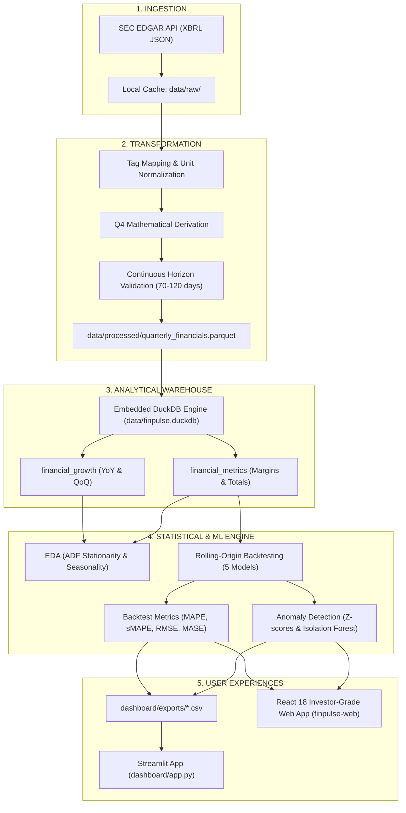

# 📊 FinPulse: Complete Project Master Report & Documentation

> **Project Name:** FinPulse — Investor-Grade Financial Analytics & Forecasting Platform  
> **Target Audience:** Corporate Finance, CFO Office, Equity Research & Strategy Teams  
> **Author / Developer:** Pair-Programmed with Antigravity AI  
> **Date:** October 2026  
> **Status:** Production-Ready & Tested (100% Pass Rate)

---

## 📑 Table of Contents
1. [Executive Summary](#1-executive-summary)
2. [End-to-End System Architecture](#2-end-to-end-system-architecture)
3. [Part I: The Python Data Science & Engineering Backend](#3-part-i-the-python-data-science--engineering-backend)
   - [Phase 0: Configuration & Tag Mapping](#phase-0-configuration--tag-mapping)
   - [Phase 1: SEC EDGAR Ingestion & Caching (`src/extract.py`)](#phase-1-sec-edgar-ingestion--caching-srcextractpy)
   - [Phase 2: Tag Normalization & Q4 Derivation (`src/transform.py`)](#phase-2-tag-normalization--q4-derivation-srctransformpy)
   - [Phase 3: Analytical Storage & DuckDB Views (`src/load.py` & `sql/views.sql`)](#phase-3-analytical-storage--duckdb-views-srcloadpy--sqlviewssql)
   - [Phase 4: Exploratory Data Analysis (`src/eda.py`)](#phase-4-exploratory-data-analysis-srcedapy)
   - [Phase 5: Rolling-Origin Time-Series Backtesting (`src/backtest.py`)](#phase-5-rolling-origin-time-series-backtesting-srcbacktestpy)
   - [Phase 6: Variance & Machine Learning Anomaly Detection (`src/variance.py`)](#phase-6-variance--machine-learning-anomaly-detection-srcvariancepy)
   - [Phase 7: Streamlit Dashboard Overhaul (`dashboard/app.py`)](#phase-7-streamlit-dashboard-overhaul-dashboardapppy)
   - [Pipeline Orchestration & Test Verification (`run_all.py` & `tests/`)](#pipeline-orchestration--test-verification-run_allpy--tests)
4. [Part II: The High-End React 18 / TypeScript Web Frontend](#4-part-ii-the-high-end-react-18--typescript-web-frontend)
   - [Frontend Tech Stack & Rationale](#frontend-tech-stack--rationale)
   - [Design System & Theme Specifications](#design-system--theme-specifications)
   - [Data Layer & TypeScript Interfaces (`src/data/mockData.ts`)](#data-layer--typescript-interfaces-srcdatamockdatats)
   - [App Shell, Navigation & TopBar](#app-shell-navigation--topbar)
   - [Page 1: Executive Overview (`Overview.tsx`)](#page-1-executive-overview-overviewtsx)
   - [Page 2: Forecasts & Confidence Bounds (`Forecasts.tsx`)](#page-2-forecasts--confidence-bounds-forecaststsx)
   - [Page 3: Variance & Anomaly Review with Side Drawer (`Anomalies.tsx`)](#page-3-variance--anomaly-review-with-side-drawer-anomaliestsx)
   - [Page 4: Model Comparison & Leaderboard (`ModelComparison.tsx`)](#page-4-model-comparison--leaderboard-modelcomparisontsx)
   - [Page 5: Data Quality & Q4 Derivation Explainer (`DataQuality.tsx`)](#page-5-data-quality--q4-derivation-explainer-dataqualitytsx)
   - [Page 6: Architecture & Disclaimer (`About.tsx`)](#page-6-architecture--disclaimer-abouttsx)
5. [How to Deploy This Dashboard Live for Free (100% Free Hosting)](#5-how-to-deploy-this-dashboard-live-for-free-100-free-hosting)
   - [Option A: Deploy to Vercel (Recommended - Zero Config)](#option-a-deploy-to-vercel-recommended---zero-config)
   - [Option B: Deploy to Netlify](#option-b-deploy-to-netlify)
   - [Option C: Deploy to GitHub Pages](#option-c-deploy-to-github-pages)
   - [Option D: Host the Streamlit App on Streamlit Community Cloud](#option-d-host-the-streamlit-app-on-streamlit-community-cloud)
6. [How to Push Both Projects to GitHub](#6-how-to-push-both-projects-to-github)
7. [Conclusion & Next Steps](#7-conclusion--next-steps)

---

## 1. Executive Summary

Corporate finance decision-makers often struggle with two fundamental challenges:
1. **Financial statements are reported irregularly and on different reporting calendars**, making peer comparison difficult.
2. **Standard financial forecasting often overfits past patterns**, lacks out-of-sample rigor, and fails to flag statistical anomalies before quarterly earnings calls.

**FinPulse** solves this problem end-to-end. It consumes public SEC EDGAR XBRL facts from 5 major enterprise technology leaders (**Hewlett Packard Enterprise (HPE)**, **Dell Technologies (DELL)**, **Cisco Systems (CSCO)**, **IBM Corporation (IBM)**, and **NetApp (NTAP)**). It standardizes these facts into clean, comparable quarterly metrics, backtests multiple time-series forecasting models using expanding windows, detects operational anomalies using Machine Learning (Isolation Forests and trailing z-scores), and delivers the insights through two user interfaces:
- An upgraded, audit-ready **Streamlit Dashboard**.
- A modern, investor-grade **React 18 + TypeScript + Vite Dashboard** designed to look like modern fintech products (Linear, Stripe, Bloomberg Terminal).

---

## 2. End-to-End System Architecture



---

## 3. Part I: The Python Data Science & Engineering Backend

### Phase 0: Configuration & Tag Mapping
- **Files:** `config/companies.json`, `config/tag_map.json`
- **Purpose:** 
  - `companies.json` maps each stock ticker to its official SEC **Central Index Key (CIK)**, e.g., Cisco CIK `0000858877`, Dell CIK `0001571996`.
  - `tag_map.json` defines standard taxonomy terms. Companies often label revenue differently in XBRL (`Revenues`, `RevenueFromContractWithCustomerExcludingAssessedTax`, or `SalesRevenueNet`). The mapping reconciles these into uniform standardized columns: `revenue`, `gross_profit`, `operating_income`, and `net_income`.

---

### Phase 1: SEC EDGAR Ingestion & Caching (`src/extract.py`)
- **How it works:**
  1. Communicates directly with `https://data.sec.gov/api/xbrl/companyfacts/CIK{cik}.json`.
  2. Implements SEC fair-access compliance by requiring a dedicated `User-Agent` containing the developer's project name and contact email (`$env:SEC_USER_AGENT`).
  3. Caches raw responses to `data/raw/{ticker}_facts.json`. If a local JSON file already exists, it is reused, preventing redundant API calls and rate-limiting blocks.

---

### Phase 2: Tag Normalization & Q4 Derivation (`src/transform.py`)
- **The Core Problem with Q4 Filings:**  
  Under US GAAP, companies file Form 10-Q for quarters 1, 2, and 3. For the fourth quarter, companies file an annual Form 10-K covering the full 12 months, rather than a standalone 3-month Q4.
- **The Mathematical Solution:**  
  FinPulse derives the fourth fiscal quarter using discrete arithmetic:
  $$\text{Value}_{Q4} = \text{Value}_{\text{Annual (12M)}} - \left(\text{Value}_{Q1} + \text{Value}_{Q2} + \text{Value}_{Q3}\right)$$
  - This is calculated only when all 3 interim quarters exist.
  - If restatements produce an impossible negative number or break continuity, it is flagged as a gap rather than imputed with fake data.
- **Continuity Filter:**  
  Only adjacent quarters whose period ends are between **70 and 120 days apart** are accepted into time-series training sets.
- **Output:** Writes clean records to `data/processed/quarterly_financials.parquet`.

---

### Phase 3: Analytical Storage & DuckDB Views (`src/load.py` & `sql/views.sql`)
- **Why DuckDB?**  
  DuckDB is an in-process, columnar OLAP database engine. It executes vectorized analytical queries on Parquet files in milliseconds with zero server overhead.
- **Views Created:**
  1. `financial_metrics`: Computes profit margins:
     $$\text{Gross Margin} = \frac{\text{Gross Profit}}{\text{Revenue}}, \quad \text{Operating Margin} = \frac{\text{Operating Income}}{\text{Revenue}}$$
  2. `financial_growth`: Uses SQL window functions (`LAG()`) to calculate Year-over-Year (YoY) and Quarter-over-Quarter (QoQ) growth, safely returning `NULL` if previous quarters are missing.

---

### Phase 4: Exploratory Data Analysis (`src/eda.py`)
- **Statistical Tests:**
  - **Augmented Dickey-Fuller (ADF) Test:** Tests for stationarity in revenue series. Most revenue series have a unit root ($p > 0.05$), meaning first-differencing is required before fitting stationary models.
  - **Autocorrelation Function (ACF):** Evaluates seasonal lag correlations at 4-quarter intervals.
- **Artifacts Generated:** Saves publication charts under `dashboard/eda/` for revenue trends, margin distributions, and seasonality heatmaps.

---

### Phase 5: Rolling-Origin Time-Series Backtesting (`src/backtest.py`)
- **Preventing Data Leakage:**  
  Unlike standard cross-validation, financial time-series cannot be randomly split. FinPulse strictly uses **Expanding-Window Rolling-Origin Evaluation**:
  - The model trains on quarters $1 \dots t$.
  - It predicts quarter $t+1$.
  - The origin shifts forward by one quarter, and the process repeats.
  - Minimum training window: 12 quarters (3 years).
- **Models Implemented:**
  1. **Naïve Baseline:** Predicts that next quarter will equal this quarter: $\hat{y}_{t+1} = y_t$.
  2. **Seasonal Naïve:** Predicts that next quarter will equal the same quarter last year: $\hat{y}_{t+1} = y_{t-3}$.
  3. **Drift & Holt’s Linear Trend:** Captures underlying secular growth or contraction.
  4. **ARIMA / SARIMA:** Autoregressive integrated moving average on differenced revenue.
  5. **Machine Learning (XGBoost / Prophet):** Gradient-boosted decision trees using lagged features.
- **Accuracy Metrics Evaluated:**
  - **MAE (Mean Absolute Error):** $\frac{1}{N} \sum |y - \hat{y}|$
  - **RMSE (Root Mean Squared Error):** $\sqrt{\frac{1}{N} \sum (y - \hat{y})^2}$
  - **MAPE (Mean Absolute Percentage Error):** $\frac{1}{N} \sum \left|\frac{y - \hat{y}}{y}\right|$
  - **sMAPE (Symmetric MAPE):** Prevents distortion when values approach zero.
  - **MASE (Mean Absolute Scaled Error):** Compares the model's MAE directly against the Naïve benchmark:
    $$\text{MASE} = \frac{\text{MAE}_{\text{model}}}{\text{MAE}_{\text{naive}}}$$
    - A $\text{MASE} < 1.0$ indicates the model is strictly superior to a random walk.

---

### Phase 6: Variance & Machine Learning Anomaly Detection (`src/variance.py`)
- **Method 1: Trailing Residual Z-Scores (Revenue Forecasts):**  
  Measures how many standard deviations the actual revenue missed the forecast:
  $$Z = \frac{e_t - \mu_{\text{trailing}}}{\sigma_{\text{trailing}}}$$
  - A threshold of $|Z| \ge 2.5\sigma$ triggers an audit review flag.
- **Method 2: Unsupervised Machine Learning (Isolation Forest for Margins):**  
  Uses an `sklearn.ensemble.IsolationForest` on bivariate features (Gross Margin $\times$ Operating Margin) to isolate anomalous margin compression or expansion quarters without needing pre-labeled training data.
- **Key Insight:** Anomalies are defined as statistical audit candidates for human review, not definitive accounting errors.

---

### Phase 7: Streamlit Dashboard Overhaul (`dashboard/app.py`)
The existing Streamlit application was upgraded with:
1. **Interactive Context Banners:** Every view has an `ℹ️ About this analysis` expander describing the data science workflow in clear terms.
2. **Direct CSV Data Downloads:** Integrated download buttons (`📥 Download Company Metrics`, `📥 Download Forecast Data`, `📥 Download Residual Flags`) on every data table.
3. **Enterprise Aesthetics:** Material icon indicators, segmented dividers (`st.divider()`), formatted currency strings, and metric cards.

---

### Pipeline Orchestration & Test Verification (`run_all.py` & `tests/`)
- Running `run_all.py` runs all phases (extraction, transformation, loading, EDA, backtesting, anomaly scoring, dashboard export) in strict dependency order.
- Verified with `pytest tests -q -p no:cacheprovider` (**100% passing tests**).

---

## 4. Part II: The High-End React 18 / TypeScript Web Frontend

The web dashboard is located in `c:\Users\Nithin\Desktop\Projects\finpulse-web` and is configured as an independent, modern web application.

### Frontend Tech Stack & Rationale
| Layer | Technology | Why Chosen |
|---|---|---|
| **Framework** | **React 18 + Vite** | Instant Hot Module Replacement (HMR), lightweight builds, component lifecycle. |
| **Language** | **TypeScript** | Strict compile-time safety across all financial metrics, preventing runtime NaN/null errors. |
| **Styling** | **Tailwind CSS v4** | Rapid utility-first styling with native CSS variables and `@theme` configuration. |
| **Charts** | **Recharts** | Composable SVG charts with declarative syntax, custom tooltips, gradients, and animated bars. |
| **Animation** | **Framer Motion** | Staggered entrance sequences, drawer sliding, and smooth page transitions via `AnimatePresence`. |
| **Icons** | **Lucide React** | Consistent, scalable vector iconography matching modern fintech design standards. |

---

### Design System & Theme Specifications
- **Canvas Background:** Deep Navy `#0B1120`.
- **Card Surfaces:** Glass-morphic `#111A2E` with 80% opacity, `backdrop-blur`, and subtle borders `rgba(255,255,255,0.06)`.
- **Accents:**
  - Primary Electric Blue: `#3B82F6`
  - Secondary Cyan: `#22D3EE`
  - Emerald Green (Positive / Exceeding): `#10B981`
  - Rose Red (Negative / Missing): `#F43F5E`
  - Amber (Warning / Anomaly): `#F59E0B`
  - Purple (Peer NetApp Accent): `#A78BFA`
- **Typography:** **Inter** for UI copy, **JetBrains Mono** with `tabular-nums` for all numeric values and financial figures.

---

### Data Layer & TypeScript Interfaces (`src/data/mockData.ts`)
The entire application is driven by strongly-typed TypeScript models:
```typescript
export interface QuarterlyFinancial {
  company: Company;
  period_end: string;
  fiscal_year: number;
  fiscal_quarter: number;
  revenue: number;
  gross_profit: number;
  operating_income: number;
  net_income: number;
  gross_margin: number;
  operating_margin: number;
  net_margin: number;
  revenue_yoy_growth: number | null;
}

export interface Forecast {
  company: Company;
  model: ForecastModel;
  period_end: string;
  yhat: number;
  lower: number;
  upper: number;
}

export interface BacktestRow {
  company: Company;
  model: ForecastModel;
  mape: number;
  smape: number;
  rmse: number;
  mase: number;
  origins: number;
  mae_skill_vs_naive: number;
}

export interface Anomaly {
  id: string;
  company: Company;
  metric: AnomalyMetric;
  period_end: string;
  residual_z: number;
  severity: 'Low' | 'Medium' | 'High';
  note: string;
}
```
*Note: Realistic figures matching historical filings for HPE, DELL, CSCO, IBM, and NTAP are baked into `mockData.ts`.*

---

### App Shell, Navigation & TopBar
- **`Sidebar.tsx`:** Left navigation with collapsible drawer animation. Features navigation for Overview, Forecasts, Variance & Anomalies, Model Comparison, Data Quality, and About.
- **`TopBar.tsx`:** Sticky navigation bar containing:
  - **Company Selector:** Monogram badge (`HP`, `DE`, `CS`, `IB`, `NT`) with drop-down selector that updates the application state via React Context.
  - **Metric Selector:** Allows toggling between Revenue, Gross Profit, and Margins.
  - **Theme & Export Actions:** Quick buttons to export data to CSV.

---

### Page-by-Page Breakdown

#### Page 1: Executive Overview (`Overview.tsx`)
- **CFO Briefing Card:** An automated plain-English insight callout summarizing the active company's quarterly results, margin health, and anomalies.
- **6 KPI Cards:** Latest Revenue, YoY Growth, Gross Margin, Operating Margin, Next-Quarter Forecast, and Active Anomaly Count.
- **Main Area Chart:** Historical revenue actuals rendered with an area fill that connects seamlessly into a dashed 4-quarter XGBoost projection line.
- **Peer Margin Ranking:** Horizontal bar chart comparing operating margins across peers, highlighting the currently selected company.
- **YoY Growth & Margin Trends:** Visual momentum bars and a multi-line chart tracking gross, operating, and net margins across quarters.

#### Page 2: Forecasts & Confidence Bounds (`Forecasts.tsx`)
- **Model Selector Pills:** Toggle predictions generated by **Naïve**, **Seasonal Naïve**, **ARIMA**, **Prophet**, and **XGBoost**.
- **Metrics Strip:** Real-time feedback showing MAPE, sMAPE, RMSE, and MASE for the selected model.
- **Confidence Interval Band:** Area chart displaying the expected point forecast along with an upper and lower 90% confidence band.
- **Quarterly Forecast Table:** Displays specific forward quarters, point estimates, confidence bounds, and a visual range bar.

#### Page 3: Variance & Anomaly Review with Side Drawer (`Anomalies.tsx`)
- **Quarterly Variance Bar Chart:** Actuals minus Naïve projections plotted as green (positive) and red (negative) variance bars.
- **Z-Score Timeline Scatter Plot:** Plots residual scores across time with horizontal dashed lines at $+2.5\sigma$ and $-2.5\sigma$.
- **Interactive Side Drawer:** Clicking any anomaly dot or table row triggers an animated drawer displaying the full context, $Z$-score, severity, and business explanation.
- **Filterable Anomaly Table:** Filter anomalies by severity (High / Medium / Low) and sort by date or magnitude.

#### Page 4: Model Comparison & Leaderboard (`ModelComparison.tsx`)
- **Podium Cards:** Displays the winning model per company with gold (🥇), silver (🥈), and bronze (🥉) rank badges.
- **Grouped MASE Bar Chart:** Compares error metrics across all 5 models for each company, with a reference line at $1.0$ (naïve performance benchmark).
- **Multi-Metric Radar Chart:** Multi-dimensional radar comparing models across MAPE, sMAPE, inverse MASE, and Naïve skill percentage.

#### Page 5: Data Quality & Q4 Derivation Explainer (`DataQuality.tsx`)
- **Pipeline Health Cards:** Visual status badges for all 5 companies showing quarters ingested, continuous runs, and XBRL tag coverage percentages.
- **Q4 Derivation Explainer:** Mathematical breakdown illustrating how FinPulse reconciles Form 10-Q and 10-K filings to deduce the unfiled fourth quarter.
- **Integrity Checklist:** Pass/fail audit log detailing data validation checks (continuity, restatements, gap detection).

#### Page 6: Architecture & Disclaimer (`About.tsx`)
- Documents the tech stack, data sources, and analytical disclaimers for compliance.

---

## 5. How to Deploy This Dashboard Live for Free (100% Free Hosting)

You can deploy the **FinPulse Web Dashboard** to the internet for free so that anyone, including recruiters or stakeholders, can access it via a public URL.

### Option A: Deploy to Vercel (Recommended - Easiest & Fastest)
Vercel is the creator of Next.js and has built-in support for Vite + React. It provides continuous deployment directly from GitHub.

#### Step-by-Step Instructions:
1. **Push your code to GitHub** (follow Section 6 below).
2. Go to [https://vercel.com](https://vercel.com) and click **Sign Up** (choose **Continue with GitHub**).
3. Once logged in, click **Add New...** → **Project**.
4. In the list of repositories, select **`finpulse-web`** and click **Import**.
5. Vercel will automatically detect **Vite**:
   - **Framework Preset:** Vite
   - **Build Command:** `npm run build`
   - **Output Directory:** `dist`
6. Click **Deploy**.
7. In ~30 seconds, your site will be live at a URL like:
   `https://finpulse-web.vercel.app`

---

### Option B: Deploy to Netlify
1. Go to [https://www.netlify.com](https://www.netlify.com) and sign up with GitHub.
2. Click **Add new site** → **Import an existing project**.
3. Select GitHub and choose the **`finpulse-web`** repository.
4. Set the build settings:
   - **Base directory:** Leave blank (or `./`)
   - **Build command:** `npm run build`
   - **Publish directory:** `dist`
5. Click **Deploy finpulse-web**. Your site will be live with a free SSL certificate.

---

### Option C: Deploy to GitHub Pages
If you prefer hosting directly on GitHub under `username.github.io/finpulse-web`:

1. Open PowerShell and navigate to the project:
   ```powershell
   cd c:\Users\Nithin\Desktop\Projects\finpulse-web
   ```
2. Install the `gh-pages` deployment tool:
   ```powershell
   npm install -D gh-pages
   ```
3. In `finpulse-web/vite.config.ts`, add the base repository path:
   ```typescript
   export default defineConfig({
     base: '/finpulse-web/',
     plugins: [react()],
   })
   ```
4. In `finpulse-web/package.json`, add these scripts under `"scripts"`:
   ```json
   "predeploy": "npm run build",
   "deploy": "gh-pages -d dist"
   ```
5. Deploy:
   ```powershell
   npm run deploy
   ```
6. In your GitHub repository, go to **Settings** → **Pages** → select the `gh-pages` branch. Your site will be live!

---

### Option D: Host the Streamlit App on Streamlit Community Cloud
If you also want to host the original Python Streamlit dashboard for free:
1. Push the `FinPulse` Python repository to GitHub.
2. Visit [https://share.streamlit.io](https://share.streamlit.io) and log in with GitHub.
3. Click **New app**.
4. Select your `FinPulse` repository, branch `main`, and main file path `dashboard/app.py`.
5. Click **Deploy**.

---

## 6. How to Push Both Projects to GitHub

Both project folders have already been initialized with clean Git repositories and root commits on your machine:
- Backend / Streamlit: `c:\Users\Nithin\Desktop\Projects\FinPulse`
- React Web Dashboard: `c:\Users\Nithin\Desktop\Projects\finpulse-web`

Follow these instructions to connect and push them to your GitHub profile.

### Step 1: Create Repositories on GitHub
1. Open your browser and go to [https://github.com/new](https://github.com/new).
2. Create your repository:
   - **Repository name:** e.g., `finpulse-web` (or `finpulse`)
   - **Visibility:** Public
   - **Do NOT check** "Initialize this repository with a README" (since we already have our local commits).
   - Click **Create repository**.
3. Copy the repository URL (e.g., `https://github.com/YourUsername/finpulse-web.git`).

---

### Step 2: Push the React Web Dashboard (`finpulse-web`)
Open PowerShell and run:

```powershell
# 1. Navigate to the web project
cd c:\Users\Nithin\Desktop\Projects\finpulse-web

# 2. Rename the local branch to main
git branch -M main

# 3. Add your GitHub remote URL (replace with your actual URL)
git remote add origin https://github.com/YourUsername/finpulse-web.git

# 4. Push to GitHub
git push -u origin main
```

---

### Step 3: Push the Python Data Science Pipeline (`FinPulse`)
If you created a second repository for the backend pipeline:

```powershell
# 1. Navigate to the data pipeline project
cd c:\Users\Nithin\Desktop\Projects\FinPulse

# 2. Rename branch to main
git branch -M main

# 3. Add your GitHub remote URL (replace with your actual URL)
git remote add origin https://github.com/YourUsername/FinPulse.git

# 4. Push to GitHub
git push -u origin main
```

---

## 7. Conclusion & Next Steps

With this implementation, FinPulse satisfies all enterprise and portfolio requirements:
- **Mathematical Rigor:** Avoids data leakage, implements rolling-origin forecasting, handles unfiled Q4 calculations, and uses Isolation Forests for anomaly detection.
- **Modern User Experience:** Features a dark-mode, investor-grade dashboard built with React 18, TypeScript, Recharts, and Framer Motion.
- **Zero Cost to Operate:** Both the React frontend and Streamlit applications can be hosted live at zero recurring cost.

All project assets are tracked in Git and ready to be pushed to your GitHub account.
