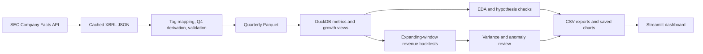

# FinPulse

Corporate financial forecasting and variance analysis using reported SEC XBRL facts.

## Status

Phases 0-7 are complete. Phase 8 is prepared locally: the README, results, interview notes, and end-to-end runner are in place. Before calling the public release complete, capture and save the dashboard page screenshots and configure a GitHub remote; neither is configured in this workspace. Issuer-specific coverage and presentation-basis caveats are recorded in `DATA_QUALITY.md`.

## Problem and architecture

FinPulse turns SEC company filings into comparable quarterly metrics for HPE, Dell, Cisco, IBM, and NetApp, then evaluates revenue forecasts and flags unusual forecast errors or margins for review. The data are latest-restated and have uneven issuer coverage, so this is an analytical prototype rather than an investment or accounting decision system.



## Results at a glance

The backtest has 53 one-quarter-ahead forecast origins across four eligible companies; IBM is excluded because its revenue series has recurring gaps that break the continuity rule. The winner column is selected and scored on the same small backtest, so treat it as exploratory.

| Company | Origins | Lowest-MAE model | MAE skill vs naive |
|---|---:|---|---:|
| CSCO | 14 | Naive | 0.0% |
| DELL | 21 | ARIMA(1,1,0) | 9.0% |
| HPE | 7 | Seasonal naive | 2.2% |
| NTAP | 11 | Seasonal naive | 64.3% |

See [BACKTEST_FINDINGS.md](BACKTEST_FINDINGS.md), [DATA_QUALITY.md](DATA_QUALITY.md), and [PHASE6_FINDINGS.md](PHASE6_FINDINGS.md) for coverage, filing-basis caveats, and reviewed anomaly examples. The existing analysis charts are saved under `dashboard/eda/`, `dashboard/backtest/`, and `dashboard/anomalies/`.

## Rebuild the data layers

Run these from the project root after setting `SEC_USER_AGENT` if the raw SEC files are absent:

```powershell
.\.venv\Scripts\python.exe src\extract.py
.\.venv\Scripts\python.exe src\transform.py
.\.venv\Scripts\python.exe src\load.py
```

The SEC downloader reuses existing raw JSON files. The transformation preserves filing/tag provenance and does not fill missing quarters. DuckDB growth views suppress calculations when the needed fiscal periods are not consecutive.

## Phase 4: exploratory analysis

From the project root, regenerate the hypothesis matrix, ADF diagnostics, and six charts:

```powershell
.\.venv\Scripts\python.exe src\eda.py
```

The CSV outputs are in `data/processed/`; charts are in `dashboard/eda/`. The notebook at `notebooks/01_eda.ipynb` is a readable walkthrough. ADF p-values are descriptive diagnostics, not model-quality scores. Calendar-quarter peer correlations are approximate because issuers use different fiscal calendars. See `EDA_FINDINGS.md` before treating any pattern as a forecasting assumption.

## Phase 5: revenue forecasting backtest

Run from the project root to regenerate one-quarter-ahead forecasts, company/model metrics, eligibility, and the MASE comparison chart:

```powershell
.\.venv\Scripts\python.exe src\backtest.py
```

The backtest uses expanding training windows, at least 12 training quarters, and only uninterrupted runs whose adjacent period ends are 70-120 days apart. Models are naive, seasonal naive, drift, damped Holt, and ARIMA(1,1,0). Results are under `data/processed/`; the chart is under `dashboard/backtest/`. `notebooks/02_backtesting.ipynb` is a walkthrough. IBM is currently excluded because its revenue facts have recurring six-month gaps. Read `BACKTEST_FINDINGS.md` before interpreting model rankings; the sample is small and the history is latest-restated.

Phase 5 is currently one-quarter-ahead only; the four-quarter horizon and prediction intervals in the original plan remain future work.

## Phase 6: variance and anomaly review

After running Phase 5, run:

```powershell
.\.venv\Scripts\python.exe src\variance.py
```

This exports actual-versus-forecast variance for every model, past-only naive-residual z-scores (flag threshold `|z| >= 2.5`), and retrospective Isolation Forest scores for gross and operating margins. Outputs are in `data/processed/` and charts in `dashboard/anomalies/`. These are review candidates, not automatic accounting errors. See `PHASE6_FINDINGS.md` for filing-checked explanations and `DATA_QUALITY.md` for restatement/reclassification caveats.

## Phase 7: dashboard

Power BI Desktop was not detected, so FinPulse uses the plan's Streamlit alternative. Install project dependencies if needed, then run:

```powershell
.\.venv\Scripts\python.exe src\export_dashboard.py
.\.venv\Scripts\python.exe -m streamlit run dashboard\app.py
```

The app has Executive Overview, Forecast vs Actual, Variance and Anomalies, and Model Comparison pages. The export command writes Power BI-ready CSVs to `dashboard/exports/`. Forecast views show historical backtest comparisons; they are not a four-quarter forward forecast.

The app is available at `http://localhost:8501` after the server starts. Stop it with `Ctrl+C` in the terminal.

## Phase 8: polish and run

After setting the SEC contact string in the current PowerShell session, run the full pipeline from the project root:

```powershell
$env:SEC_USER_AGENT = "FinPulse Your Name your.email@example.com"
.\.venv\Scripts\python.exe run_all.py
```

Replace the example identity with your own descriptive project name and contact email. `run_all.py` runs extraction, transformation, DuckDB loading, EDA, backtesting, variance/anomaly scoring, and dashboard export in dependency order. SEC JSON is reused from the local cache when present. The contact string is supplied through the environment and should not be committed.

The test suite checks pipeline order and the required SEC contact setting:

```powershell
.\.venv\Scripts\python.exe -m pytest tests -q -p no:cacheprovider
```

Interview notes with answers grounded in this dataset are in [INTERVIEW_PREP.md](INTERVIEW_PREP.md). Dashboard page screenshots should be captured before a public release; the reproducible analysis charts above are already included.

## Environment setup

Tested with Python 3.14 on Windows PowerShell:

```powershell
py -3.14 -m venv .venv
.\.venv\Scripts\Activate.ps1
python -m pip install -r requirements.txt
python -c "import duckdb, pandas, prophet, xgboost, streamlit; print('FinPulse environment OK')"
```

Use `.\.venv\Scripts\python.exe` instead of activating if script activation is restricted by your PowerShell policy.

## Project structure

- `config/`: company identifiers and metric tag mapping
- `data/raw/`: cached SEC source files (not committed)
- `data/processed/`: normalized analysis files (not committed)
- `src/`: extraction, transformation, modeling, and analysis scripts
- `run_all.py`: end-to-end pipeline orchestrator
- `sql/`: DuckDB views and queries
- `notebooks/`: exploratory analysis
- `tests/`: pipeline order and configuration checks
- `dashboard/`: Streamlit app, Power BI CSV exports, and chart outputs

## Data source

FinPulse uses public company filings and SEC EDGAR APIs. SEC access requires a descriptive `User-Agent` with a contact email. See the [SEC API documentation](https://www.sec.gov/edgar/sec-api-documentation) and [fair access guidance](https://www.sec.gov/developer).
