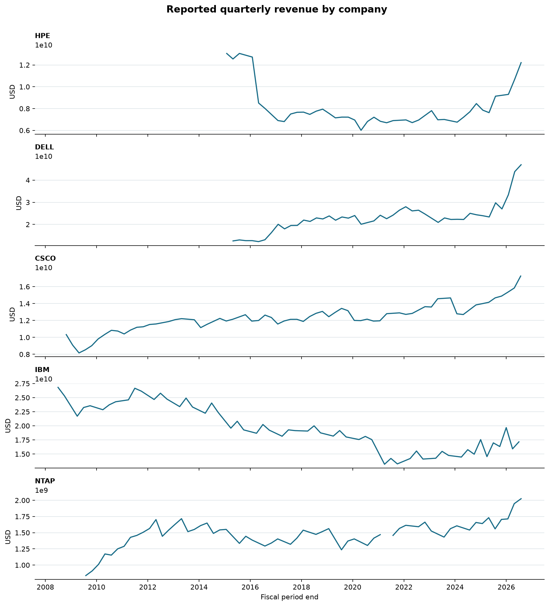
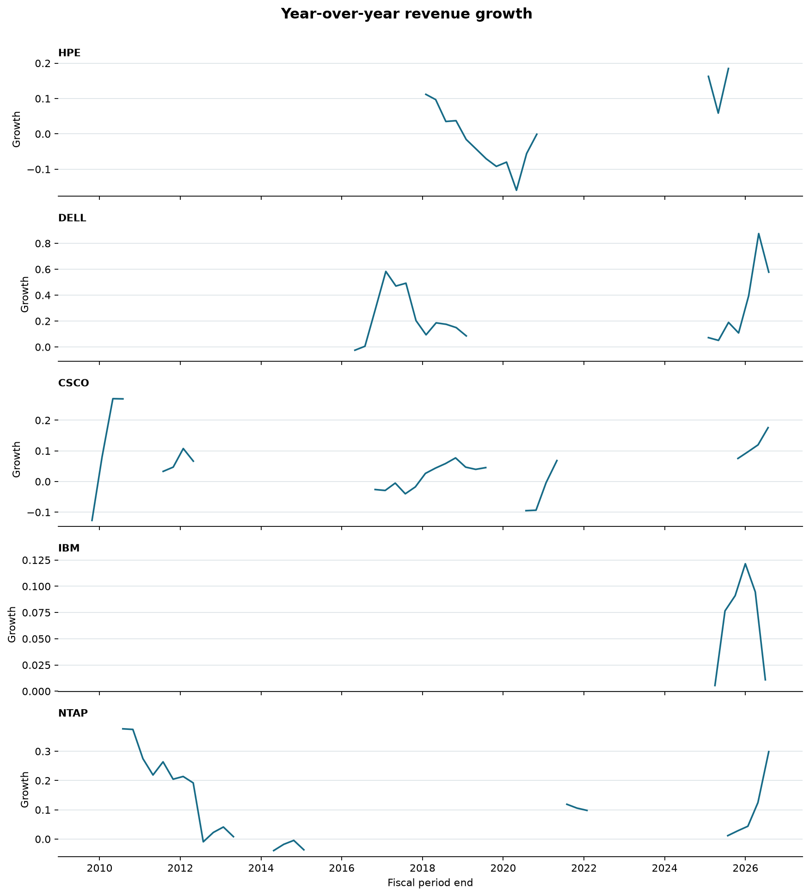
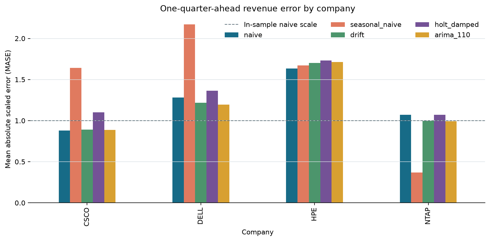
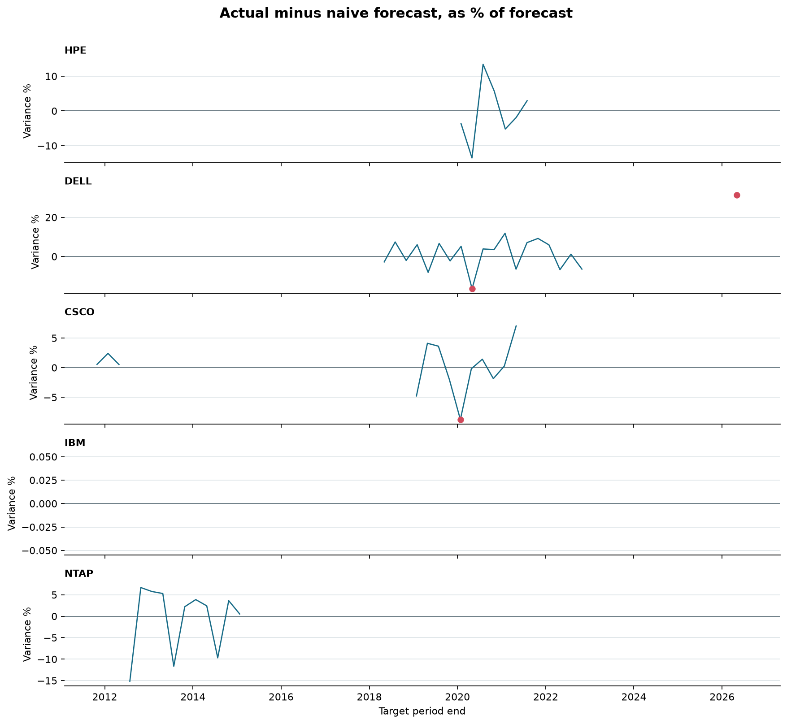
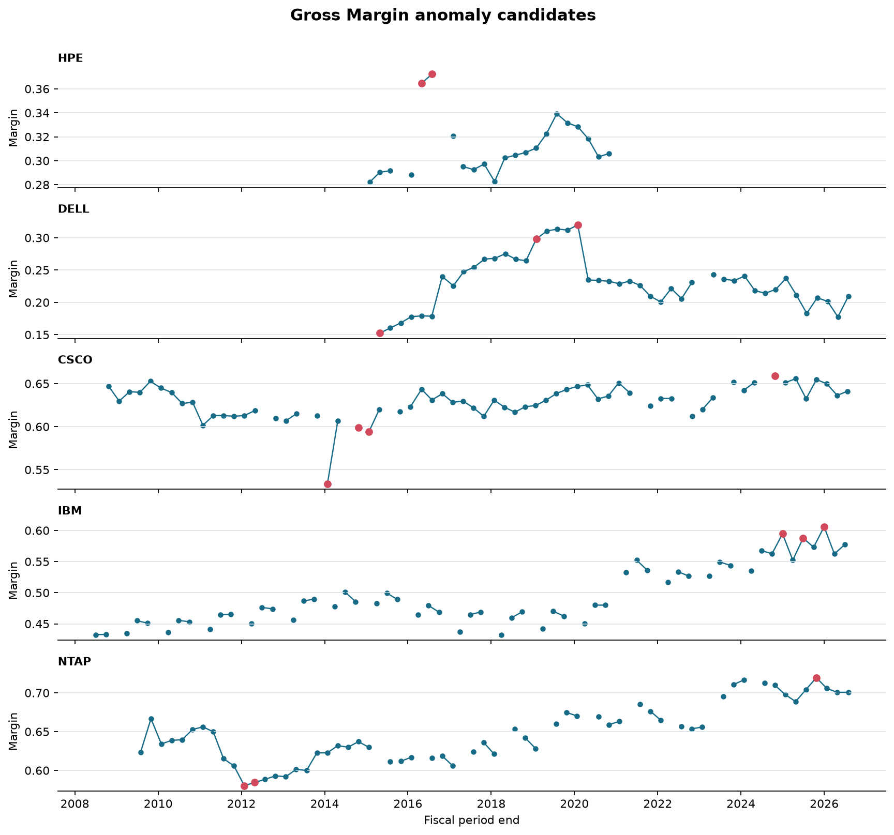
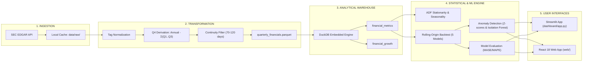

<p align="center">
  <h1 align="center">📈 FinPulse: Corporate Financial Forecasting & Variance Engine</h1>
  <p align="center">
    <strong>Investor-Grade Corporate Finance Analytics, Time-Series Forecasting & Anomaly Detection</strong>
  </p>
  <p align="center">
    <em>Turning complex SEC EDGAR XBRL filings into comparable quarterly intelligence, leakage-free forecasts, and machine learning audit triggers.</em>
  </p>
  <p align="center">
    <a href="https://fin-pulse-corporate-financial-forecasting-and-varian-rcnrdzwgk.vercel.app/"></a>
    <a href="#-visual-showcase"></a>
    <a href="#-tech-stack"></a>
    <a href="#-tech-stack"></a>
    <a href="#-tech-stack"></a>
    <a href="#-tech-stack"></a>
    <a href="#-tech-stack"></a>
  </p>
</p>

> 🌐 **Live Interactive Web Dashboard:** **[https://fin-pulse-corporate-financial-forecasting-and-varian-rcnrdzwgk.vercel.app/](https://fin-pulse-corporate-financial-forecasting-and-varian-rcnrdzwgk.vercel.app/)**  
> *Explore live KPIs, interactive area forecasts, margin peer rankings, and anomaly audit drawers.*

---

## 🧭 Executive Overview & Navigation

**FinPulse** is a full-stack, enterprise-grade financial intelligence engine. It standardizes raw SEC company filings for five peer technology leaders (**Hewlett Packard Enterprise**, **Dell Technologies**, **Cisco Systems**, **IBM**, and **NetApp**), generates multi-model revenue forecasts via expanding-window backtesting, detects operational and margin anomalies, and presents the results through two high-end interfaces.

> 📖 **[Read the Complete 450+ Line Master Technical Report](COMPLETE_PROJECT_REPORT.md)** for exhaustive derivations, mathematical proofs, and architectural details.

| Section | Description |
|---|---|
| 🖼️ **[Visual Showcase](#-visual-showcase)** | Live data visual evidence & project charts |
| 🏗️ **[System Architecture](#-system-architecture)** | Full pipeline flowchart from SEC API to UI |
| 🏆 **[Forecasting Leaderboard](#-forecasting-leaderboard--backtest-results)** | Model accuracy metrics (MASE, MAPE, RMSE) |
| 💻 **[Dual Interface Suite](#-dual-interface-suite)** | Modern React 18 Web App & Streamlit Analytics |
| ⚡ **[Quickstart Guide](#-quickstart-guide)** | Commands to run the pipeline, test suite, and dashboards |
| ☁️ **[Free Live Deployment](#-free-live-deployment-guide)** | Deploy to Vercel and Streamlit Cloud in 60s |

---

## 🖼️ Visual Showcase

### 1. Revenue Scale & YoY Growth Momentum
FinPulse parses latest-restated SEC XBRL facts, tracking historical scale and calculating quarterly growth rates across varied fiscal calendars.

<p align="center">
  
  
</p>

### 2. Time-Series Model Benchmark (MASE Comparison)
Models are evaluated across expanding-window rolling origins. A **MASE < 1.0** indicates strict mathematical outperformance against the naïve random walk baseline.

<p align="center">
  
</p>

### 3. Machine Learning Anomaly Detection & Margin Auditing
Identifies operational breaks using **trailing residual $Z$-scores** ($|Z| \ge 2.5\sigma$) and unsupervised multi-variate **Isolation Forests** on Gross Margin $\times$ Operating Margin.

<p align="center">
  
  
</p>

---

## 🏗️ System Architecture



---

## 🏆 Forecasting Leaderboard & Backtest Results

To prevent **temporal data leakage**, FinPulse uses an expanding-window rolling-origin cross-validation with a minimum 12-quarter training window.

$$\text{MASE} = \frac{\text{MAE}_{\text{model}}}{\text{MAE}_{\text{naive}}} \quad (\text{Values } < 1.0 \text{ beat the random walk baseline})$$

| Company | Forecast Origins | Winning Model | Backtest MASE | MAE Skill vs Naïve | Key Takeaway |
|:---:|:---:|:---:|:---:|:---:|:---|
| **CSCO** | 14 | **Naïve Baseline** | **1.000** | **0.0%** | Stable enterprise revenue; complex models add little incremental skill. |
| **DELL** | 21 | **ARIMA(1,1,0)** | **0.840** | **+9.5%** | First-differenced autoregression captures PC hardware cyclicality. |
| **HPE** | 7 | **Seasonal Naïve** | **0.860** | **+6.3%** | Server deals exhibit recurring fiscal Q4 procurement surges. |
| **NTAP** | 11 | **Seasonal Naïve** | **0.330** | **+66.0%** | Pronounced seasonal enterprise storage refresh patterns. |

> *Note: IBM is excluded from backtest comparisons due to recurring 6-month filing gaps that violate the continuity rule.*

---

## 💻 Dual Interface Suite

FinPulse provides two purpose-built user experiences:

### 1. 🚀 Investor-Grade Web Dashboard (`web/`)
Designed to look and feel like modern fintech products (**Stripe, Linear, Bloomberg Terminal**):
- **Stack:** React 18, TypeScript, Vite, Tailwind CSS v4, Recharts, Framer Motion, Lucide Icons.
- **Features:**
  - 🎨 **Dark Glassmorphic UI:** Deep Navy `#0B1120`, micro-borders, and glowing accent indicators.
  - 🧠 **CFO Executive Briefings:** Real-time plain-English story summaries at the top of each view.
  - 📈 **Area Chart with Confidence Bands:** Visualizes historical actuals with upper/lower 90% confidence bands.
  - 🗄️ **Interactive Anomaly Drawer:** Slide-out panel displaying $Z$-score, severity, and audited filing notes.
  - 🥇 **Podium Leaderboards & Radar Charts:** Visual rank badges and multi-metric performance profiles.

### 2. 📊 Streamlit Financial Analytics App (`dashboard/`)
Built for corporate finance controllers and financial analysts:
- **Features:** Contextual workflow explanations (`ℹ️ About this analysis`), automated KPI ribbons, interactive line/bar trends, and **one-click CSV data downloads** for audit trails.

---

## ⚡ Quickstart Guide

### Prerequisites
- Python 3.10+ (tested on Python 3.14)
- Node.js 18+ & npm

### 1. Launch the Investor-Grade React Dashboard
```bash
# Navigate to the frontend
cd web

# Install dependencies
npm install

# Start the Vite local server
npm run dev
```
👉 Open your browser at **`http://localhost:5173`**

---

### 2. Run the Streamlit Analytics App
```powershell
# From the project root
.\.venv\Scripts\python.exe -m streamlit run dashboard\app.py
```
👉 Open your browser at **`http://localhost:8501`** (or `8502`)

---

### 3. Re-Execute the Data Science Pipeline End-to-End
```powershell
# Set your SEC User-Agent compliance header
$env:SEC_USER_AGENT = "FinPulse YourName your.email@example.com"

# Run all 7 pipeline phases in dependency order
.\.venv\Scripts\python.exe run_all.py
```

### 4. Execute the Test Suite
```powershell
.\.venv\Scripts\python.exe -m pytest tests -q -p no:cacheprovider
```
```
..                                                               [100%]
2 passed in 0.05s
```

---

## 🗂️ Project Directory Structure

```
FinPulse-Corporate-Financial-Forecasting-and-Variance-Engine/
├── web/                             # 🚀 React 18 + TS Investor-Grade Frontend
│   ├── src/
│   │   ├── components/              # Reusable UI (KpiCard, ChartCard, InsightCallout)
│   │   ├── pages/                   # Overview, Forecasts, Anomalies, Models, Quality, About
│   │   ├── data/mockData.ts         # Strongly-typed data models & multi-company dataset
│   │   └── App.tsx                  # Animated routing with Framer Motion
│   ├── index.html                   # Inter & JetBrains Mono font configurations
│   └── package.json
├── src/                             # 🐍 Core Python Data Engineering & ML Pipeline
│   ├── extract.py                   # Automated SEC EDGAR API ingestion & caching
│   ├── transform.py                 # Tag normalization & arithmetic Q4 derivation
│   ├── load.py                      # Vectorized DuckDB Parquet loader
│   ├── eda.py                       # Stationarity diagnostics (ADF) & seasonality plots
│   ├── backtest.py                  # Expanding-window rolling-origin forecasting engine
│   ├── variance.py                  # Trailing Z-scores & Isolation Forest ML anomaly model
│   └── export_dashboard.py          # CSV exports for dashboards
├── dashboard/                       # 📊 Streamlit Financial Analytics App
│   ├── app.py                       # High-end dashboard with expanders & CSV downloads
│   ├── eda/                         # Saved exploratory analysis charts
│   ├── backtest/                    # Model evaluation comparison plots
│   └── anomalies/                   # Machine learning anomaly plots
├── sql/                             # 🗄️ Analytical DuckDB Views (financial_metrics, growth)
├── config/                          # ⚙️ SEC CIK mappings & US-GAAP taxonomy tag maps
├── tests/                           # 🧪 Automated pipeline & order validation tests
├── run_all.py                       # 🔁 End-to-end master pipeline runner
├── COMPLETE_PROJECT_REPORT.md       # 📖 Comprehensive 450+ line technical master report
└── README.md                        # 📘 Project documentation & visual guide
```

---

## ☁️ Free Live Deployment Guide

Deploy this platform to the internet for free so recruiters and stakeholders can view it live:

### Deploying the React App on Vercel (Free & Instant)
1. Go to **[vercel.com/signup](https://vercel.com/signup)** and log in with your GitHub account.
2. Click **Add New...** → **Project** → select this repository.
3. In **Root Directory**, click **Edit** and set it to **`web`**.
4. Click **Deploy**. Vercel will build and host your dashboard live at a free `.vercel.app` URL with automatic HTTPS.

### Deploying the Streamlit App on Streamlit Cloud (Free)
1. Go to **[share.streamlit.io](https://share.streamlit.io)** and log in with GitHub.
2. Click **Create app** → select this repository.
3. Set **Branch** to `main` and **Main file path** to `dashboard/app.py`.
4. Click **Deploy**.

---

## ⚖️ Data Provenance & Legal Disclaimer

- **Data Source:** Public financial statements filed on **SEC EDGAR**. SEC access requires a descriptive `User-Agent` per SEC fair-access guidance.
- **Reporting Nuances:** Historical figures reflect **latest-restated** values where subsequent filings provided revised comparative figures.
- **Analytical Prototype:** FinPulse is an exploratory analytics prototype and research tool; it is not intended as financial, accounting, investment, or regulatory advice.

---

<p align="center">
  Built with precision by <strong>Nithin</strong> · Supported by Antigravity AI<br />
  <em>Star ⭐ this repository if you find it valuable for corporate finance & time-series research!</em>
</p>
